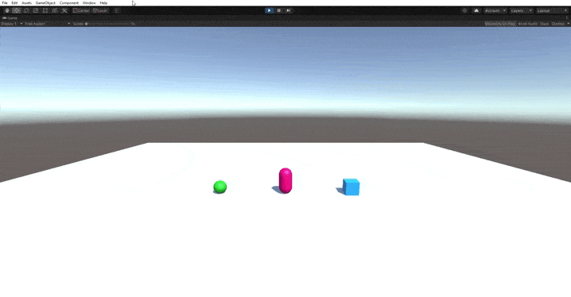

# P3 - Eventos, Delegados
* **Asignatura:** Interfaces Inteligentes
* **Autor:** Marta Julia González Padrón
* **Correo:** alu0101254487@ull.edu.es

## Enunciado Práctica

### Cuando el jugador colisiona con un objeto de tipo B, el objeto A mostrará un texto en una UI de Unity. Cuando toca el objeto A se incrementará la fuerza del objeto B

Para este apartado el objeto A será representado por la esfera verde y el objeto B por el cubo azul. Primero creamos en el apartado Gameobject -> UI -> Text. Ahora dentro de los objetos podremos acceder al texto y modificarlo para que muestre el mensaje que queremos.

**Script del Objeto A:**

```csharp
using System.Collections;
using System.Collections.Generic;
using UnityEngine;
using UnityEngine.UI;

public class ObjectA : MonoBehaviour {
    public delegate void delegateCollisionA();
    public static event delegateCollisionA eventCollisionA;
    private Text displayText;

    void Start() {
      displayText = GameObject.Find("Text").GetComponent<Text>();
      ObjectB.eventCollisionB += printOnScreen;
    }

    void  OnCollisionEnter(Collision collision) {
      if (collision.gameObject.name == "Player") {
        eventCollisionA();
      }
    }

    void printOnScreen() {
      displayText.text = "Soy el objeto A.\nEl jugador colisionó con el objeto B.";
    }
}
```

**Script del Objeto B:**

```csharp
using System.Collections;
using System.Collections.Generic;
using UnityEngine;
using UnityEngine.UI;

public class ObjectB : MonoBehaviour {
    public delegate void delegateCollisionB();
    public static event delegateCollisionB eventCollisionB;
    private Text displayText;
    private int forceA;
    void Start() {
      forceA = 0;
      displayText = GameObject.Find("Text").GetComponent<Text>();
      ObjectA.eventCollisionA += incrementForce;
    }

    void  OnCollisionEnter(Collision collision) {
      if (collision.gameObject.name == "Player") {
        eventCollisionB();
      }
    }

    void incrementForce() {
      forceA++;
      displayText.text = "Soy el objeto B.\nEl jugador colisionó con el objeto A y por eso su fuerza aumenta.\n" +
      "Fuerza del objeto A:" + forceA;
    }
}
```

En el siguiente gif, se puede ver como el texto se va actualizando y el contador de fuerza del objeto A va incrementando según el jugador colisiona con el objeto B.




### 2. Cuando el jugador se aproxima al objeto de tipo A, el objeto de tipo B cambian su color y el cubo se orientan hacia un objetivo ubicado en la escena con ese propósito. Consultar información de la clase Vector3: LookAt, RotateTowards, ...

Para hacer esto se ha creado el objeto **Cube** que es el que va a rotarse hacia el objeto B cuando el jugador esta cerca del objeto A. Para esto he añadido dos nuevos eventos a *delegateA*, uno para que el cubo rote su posición hacia el objeto B `public static event delegateA eventDistanceA;` y otro para que resetee su rotación `public static event delegateA eventResetA;`.

Ahora el metodo **Update** del ObjetoA se ve de la siguiente manera:

```csharp
  void Update() {
    float distanceWithPlayer = Vector3.Distance(player.GetComponent<Rigidbody>().position, transform.position);
    if (distanceWithPlayer < 2f) {
      eventDistanceA();
    } else {
      eventResetA();
    }
  }
```

Evidentemente habiendo declarado previamente el player `GameObject player;` e igualandolo al Fame Object del Jugador `player = GameObject.Find("Player");`.

Para que el objetoB cambie de color, en su funcion **Start** se suscribe al evento `ObjectA.eventDistanceA += changeColor;` y en **changeColor** cambia su color:

```csharp
  void changeColor() {
    Color newColor = new Color(Random.value, Random.value, Random.value, Time.deltaTime);
    GetComponent<Renderer>().material.color = newColor;
  }
```

Finalmente el codigo del cubo se ve de la siguiente forma:

```csharp
using System.Collections;
using System.Collections.Generic;
using UnityEngine;

public class Cube : MonoBehaviour {

  public Transform target;
  // Start is called before the first frame update
  void Start() {
    ObjectA.eventDistanceA += Look;
    ObjectA.eventResetA += ResetRotation;
    target = GameObject.Find("ObjectB").GetComponent<Transform>();
  }

  void Look() {
    transform.LookAt(target);
  }
  void ResetRotation() {
    transform.rotation = Quaternion.identity;
  }
}
```


### 3. Implementar un controlador que mueva el objeto con wasd

Igual que en prácticas anteriores, esto se hace modificando la posicion del objeto en cuestión al escuchar la entrada de una tecla específica.

```csharp
  void Update() {
    if (Input.GetKeyDown(KeyCode.A)) {
      transform.position += Vector3.left;
    } else if (Input.GetKeyDown(KeyCode.D)) {
      transform.position += Vector3.right;
    } else if (Input.GetKeyDown(KeyCode.W)) {
      transform.position += Vector3.forward;
    } else if (Input.GetKeyDown(KeyCode.S)) {
      transform.position += Vector3.back;
    }
  }
```


Como se observa en el gif, si el jugador está cerca del objeto B, aunque el cubo se mueva, sigue orientado al objeto A.


### 4. Buscar información de Debug.DrawRay y utilízala para depuración.

Para depurar en Unity se puede usar funciones que vienen ya integradas para ese uso. En este caso vamos a usar **Debug.DrawRay** Para ver claramente como el cubo se orienta hacia el objeto.
Es tan sencillo como añadir esta linea en las partes donde se modifica la rotación:

```csharp
Debug.DrawRay(transform.position, transform.forward * 5, Color.red, 0.1f, true);
```

Al darle a play, en la pestaña de la escena se verá así:


